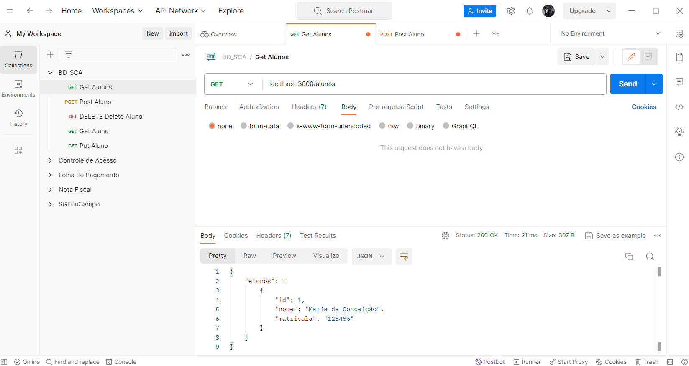
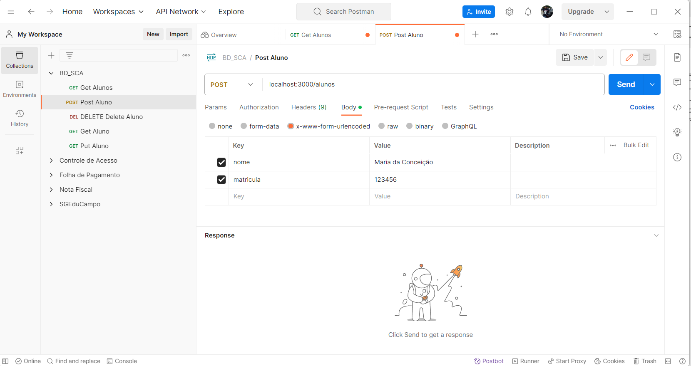

# Server Node #

>
Servidor Node.js com API Rest que acessa um banco de Dados de
Dados SQLite3 executando funcionalidades CRUD. 
>
> 
O Acesso ao banco de dados é feito com Strings que contêm comandos 
SQL. 
>

>
Chamar a execução do servidor com o comando abaixo:
> 

```
$ node app.js
```

## POSTMAN ##
>
O Postman simula as chamadas das APIs REST. Simula um cliente da aplicação 
servidora app.js.
>
>
Assistir os vídeos:
1) [Como usar o Postman para Testar APIs Rest (Aula 10)] (https://www.youtube.com/watch?v=5S9mMBEtJK4).

2) [Postman: tudo o que você precisa saber na prática] (https://www.youtube.com/watch?v=IaJghBTNMzw)
> 

>
Observar as configurações para executar o SEND das mensagens HHTP que 
deverão estar compatíveis com a URL programada na aplicação `app.js`. 
>
### Chamadas das API REST ####

#### API GET ####
>
A seguir temos a chamada da API Get usando o Postman como cliente web.
>
>

>

#### API POST ####
A seguir temos a chamada da API Post manusando o Postman como cliente web.
>
>
Observar as configurações `Body` e `x-www-form-urlencoded`. 
>
>

>